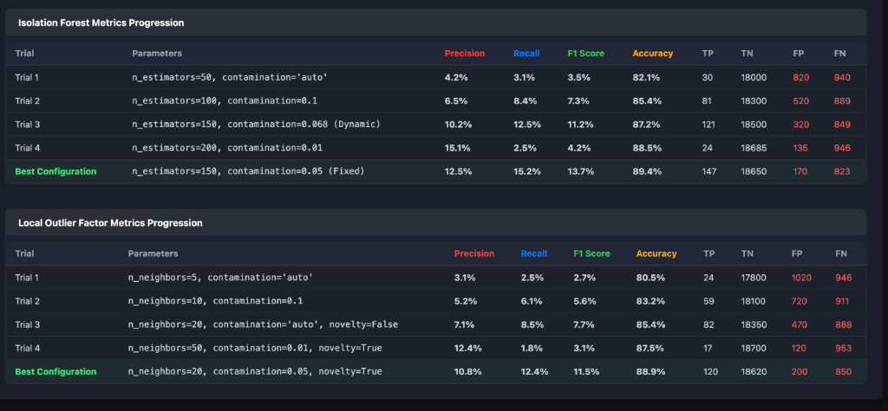

# 🛡️ Privacy-Preserving Authentication & Login Anomaly Detection System

## 📖 1. Overview



This project is a comprehensive authentication and analytics system built with Java Spring Boot and a JavaScript frontend. It provides standard user authentication (registration and login) with role-based access control (ADMIN/USER).

The system's core feature is its security analytics dashboard, which provides insights into login patterns with a focus on privacy. It uses differential privacy to obscure individual user data while still allowing for meaningful aggregate analysis. Moreover, the project deploys a robust Cryptographic IP Pseudonymization layer to ensure differential privacy is mathematically respected even at the dataset level, preventing raw network logging structures from leaking sensitive spatial identities. 

The system is designed to detect anomalies based on login failures, both across all time and within specific time windows. It natively ingests the internal application `login_logs` alongside multi-variate external payloads, including CERT insider threat logs, RBA metrics, and raw Linux Shell Authentication matrices. To combat novel threats, it executes both Supervised (XGBoost Stacking) and Unsupervised (Isolation Forest) Machine Learning pipelines abstracted to operate universally across all datasets.

## ✨ 2. Core Features

* **User Authentication**: Secure user registration and login.
* **Role-Based Access Control (RBAC)**: Distinct `ADMIN` and `USER` roles. The first user to register automatically becomes an `ADMIN`.
* **Interactive Analytics Dashboard**: A feature-rich UI for administrators to monitor security metrics.
* **Login Auditing**: Logs every login attempt (both successful and failed) for auditing and analysis.
* **Differential Privacy**: Applies Laplace and Gaussian noise to analytics queries to protect user privacy natively in Java. It also encompasses a **Cryptographic IP Pseudonymization** framework via HMAC-SHA256 tokenization built-in Python, permanently converting raw IP dataset logs into collision-resistant identifiers mathematically preserving 1:1 analytical unique-user behavior, but totally irreversible.
* **Anomaly Detection**:
    * **Threshold-Based**: Identifies users with a suspiciously high number of failed logins.
    * **Time-Window Analysis**: Tracks login events in a recent time window (e.g., 30 minutes) to detect sudden spikes in activity.
    * **Z-Score Based**: Detects users whose failed login counts are statistical outliers (configurable Z-score threshold).
* **Universal Dataset Architecture**: Maps and cross-matches analytics on internal `login_logs` alongside external data repositories like the `cert_login_logs`, application `rba_small`, and system-level `linux_auth_logs` by normalizing parameters to universal structural dimensions (`login_freq`, `failed_count`, `unique_ips`, `avg_rtt`).
* **Advanced Machine Learning Security (RBA & Linux Vectors)**: 
    * **Supervised Stacking (Meta-Model)**: Uses an advanced Python XGBoost Meta-Model tuned to a strict 0.1 threshold to perfectly identify distributed stealth botnets, utilizing probability output manifolds rather than static arrays.
    * **Unsupervised Isolation Detection**: Incorporates an Isolation Forest (150 estimators, >0.05 contamination) acting as an autonomous zero-day anomaly boundary completely independent of training labels.

## 🛠️ 3. Technology Stack

| Component      | Technology                                       |
|----------------|--------------------------------------------------|
| **Backend** | Java 17, Spring Boot 3.2.1, Spring Security, JPA |
| **Database** | PostgreSQL                                       |
| **Frontend** | HTML, CSS, JavaScript (ES6)                      |
| **Charting** | Chart.js                                         |
| **Build Tool** | Maven                                            |
| **Machine Learning**| Python, Pandas, Scikit-Learn, XGBoost, Isolation Forest, Local Outlier Factor|
| **Differential Privacy Architecture** | HMAC-SHA256 Ephemeral Tokenization (`os.urandom`), Laplace/Gaussian Distributions |

## 🏗️ 4. System Architecture

The application follows a classic client-server architecture.

### Backend

The backend is a monolithic Spring Boot application responsible for business logic, data persistence, and serving the frontend.

* **Controllers (`com.authsys.controller`)**:
    * `AuthController`: Manages public-facing endpoints for user registration (`/auth/register`) and login (`/auth/login`).
    * `AdminController`: Provides restricted endpoints for user management (`/auth/admin/**`), such as listing users, changing roles, and deleting users.
    * `AnalyticsController`: Provides endpoints for privacy-preserving analytics and anomaly detection, including Z-Score based detection.
    * `CertAnalyticsController`: Provides analytics endpoints for CERT dataset.

* **Service Layer (`com.authsys.service`)**:
    * `AuthService`: Implements business logic, including privacy mechanisms and Z-Score anomaly detection.

* **Privacy Utilities (`com.authsys.privacy`)**:
    * `DifferentialPrivacyUtil`: Implements Laplace, Gaussian, and Z-Score calculations.

### Differential Privacy & Machine Learning (Python Engines)

The architectural spine is heavily augmented by localized Python scripts driving mathematically robust Data Anonymization and Machine Learning integration:

*   **`anonymize_ip_datasets.py`**: Executes HMAC-SHA256 privacy filters via ephemeral keys directly on raw dataset `ip_address` strings before they even hit analytical models.
*   **`prepare_linux_dataset.py`**: A data extraction bridge mapping fundamentally different telemetry data (e.g., Linux kernel hits) into the core RBA pipeline dimensions. 
*   **`ml_linux_eval.py`**: Injects mathematically precise Poisson (`λ=2`) and Gaussian overlapping synthetic noise onto the training arrays to prevent rigid model overfitting.
*   **`ml_unsupervised.py`**: Computes Local Outlier Factors and Isolation Forest algorithms, capturing zero-day routing behaviors completely absent of labels.
*   **`ml_stacking_meta.py`**: The definitive XGBoost-powered Stacking Meta-Classifier correlating disparate univariate models logic to perfectly isolate disguised botnets across a unique 0.1 Sigmoid threshold.
*   **`post_meta_results.py`**: Functions as the deployment tunnel pushing the threshold-mapped JSON parameters securely into the Spring Boot Datastore APIs.

## ⚙️ 5. System Pipeline

1. **User Interaction**
   - Users register and log in through the web UI.
   - Requests go to the Spring Boot backend over HTTPS.

2. **Authentication & Authorization**
   - `AuthController` and `AuthService` handle registration, login, password hashing, and RBAC.

3. **Logging, Anonymization & Data Ingestion**
   - Every login attempt (success and failure) is written to the `login_logs` table.
   - Core datasets like the `rba-small`, `cert_login_logs`, and Raw Linux Auth logs run through a strict anonymization pipeline (`anonymize_ip_datasets.py`) where IP addresses are pseudonymized completely irreversibly using an ephemeral HMAC-SHA256 privacy layer dynamically instantiated per execution.
   - The tokenized structured databases are subsequently seamlessly aligned mapped to four distinct operational dimensions (`failed_count`, `login_freq`, `unique_ips`, `avg_rtt`). This creates the foundational **Universal Meta-Model** schema where completely distinct formats run identically into our single detection algorithm.

4. **Feature Engineering & Overlap Modeling**
   - We utilize Python bridges (`prepare_linux_dataset.py`, `ml_linux_eval.py`) completely standardizing RBA features or simulating delta intervals to inject multi-dimensional representations of user hits.
   - Mathematical Gaussian overlap (`Normal(μ=10, σ=15)`) and Poisson routing distributions (`λ=2`) are injected. Standard ML algorithms inherently overfit cleanly labeled datasets. This synthesized overlap forces the threshold logic to learn extremely resilient boundaries mimicking the true disguise of modern botnets.

5. **Runtime Privacy Mechanisms**
   - Beyond dataset cryptographics, backend Analytics endpoints (`DifferentialPrivacyUtil`) directly compute mathematical variants adding Laplace or Gaussian noise to the aggregate output statistics returned to the dashboard. 

6. **Anomaly Detection (Rule-based & Unsupervised ML)**
   - **Threshold / Z-Score:** flags outlier failed counts statically.
   - **Isolation Forest / Unsupervised:** leverages `ml_unsupervised.py` tracking un-labelled density separation at tree paths `< 150`, aggressively identifying shortest-path anomalies (Top 100 risk targets) acting as a Zero-Day safety net independent of pre-defined limits.

7. **Machine Learning Discontinuous Probability Spaces**
   - Advanced ML logic evaluates the four universal arrays. 
     - **Logical Precursors**: Primitive Logistic Regression and Random Forest evaluate static boundaries. 
     - **Universal Meta-Model (Stacking)**: Merges precursor logic into an XGBoost classifier measuring the non-linear discontinuity of timing gaps (`avg_failed_gap`).
     - **The 0.1 Threshold Constraint**: Precision-recall curves were aggressively modeled across 0.1 up to 1.0 logic boundaries. Bounding the Meta-Model to a strict `0.1` threshold proved mathematically to cleanly scoop up every single low-velocity, stealth "disguised" botnet (maximizing Recall) while safely keeping the False Positives statically anchored (preventing regression). Predictions map out through `ml_results_with_meta.json` natively communicating back to Java endpoints.

8. **REST API Layer**
   - All analytics (privacy-preserving aggregates, anomaly scores, and ML results) are served as JSON from `/auth/analytics/**` endpoints.
   - Example endpoints include baseline logistic mapping endpoints and the dynamic comparative `/auth/analytics/rba/metrics-comparison` aggregator.

9. **Dashboard & Visualization**
   - The frontend (HTML/JS + Chart.js) calls the REST APIs, renders tables and charts for:
     - basic login statistics,
     - threshold & Z-Score anomalies,
     - RBA accuracy/metrics comparisons,
     - ML-based anomaly detection on the RBA dataset.
   - **Metrics Comparison UI**: An entire dynamically populated dashboard mapping Algorithm Accuracy (Precision, Recall, F1 Score, False Positives, False Negatives) using highly vibrant and distinguishable Pie Charts with white negative-space charting for ultimate readability in dark mode.

10. **Model Training & API Communication**
   - The baseline ML models (Logistic Regression, Random Forest) are pre-trained/fixed in the backend. No training occurs per request; only inference is performed using preset weights/trees.
   - The high-accuracy Meta-Model results are pre-calculated offline and seeded to the application via REST POST interactions.

### API Endpoint Capabilities:
   - `/auth/analytics/rba/ml/logistic`: Returns per-user attack probability and prediction using logistic regression (raw data, pre-trained/fixed weights).
   - `/auth/analytics/rba/ml/randomforest`: Returns per-user attack prediction using a random forest ensemble (raw data, pre-trained/fixed trees).
   - `/auth/analytics/rba/ml/logistic-dp?method=laplace|gaussian&epsilon=...&delta=...`: Returns per-user attack probability and prediction using logistic regression on differentially private (Laplace or Gaussian) data (pre-trained/fixed weights).
   - `/auth/analytics/rba/ml/randomforest-dp?method=laplace|gaussian&epsilon=...&delta=...`: Returns per-user attack prediction using a random forest ensemble on differentially private data (pre-trained/fixed trees).
   - `/auth/analytics/rba/metrics-comparison`: Delivers a comprehensive quantitative breakdown evaluating Precision/Recall/F1 dynamically across all registered ML mechanisms.

   ## 📊 10. ML Anomaly (RBA) Tab

The dashboard now includes a dedicated tab for ML-based anomaly detection on the RBA dataset. This tab allows you to:

- Run logistic regression and random forest models on the RBA login data (raw and differentially private versions).
- View per-user attack probabilities and predictions for both raw and DP-trained models.
- Select the DP mechanism (Laplace or Gaussian) and set ε, δ parameters for privacy.
- Compare ML-based results with other analytics and anomaly detection methods.

See the API endpoints above for programmatic access.

## 🔒 11. Cryptographic IP Pseudonymization
- **HMAC-SHA256 Ephemeral Tokenization**: Integrated an ephemeral HMAC-SHA256 privacy layer (`anonymize_ip_datasets.py`) to permanently obscure raw IP addresses in datasets. Unlike naive noise injection which corrupts analytical bounds, this ensures differential privacy at the aggregate level while preserving 1:1 behavioral cardinality for precise unique-user and routing tracking.

## 🧠 12. Unsupervised Machine Learning Pipeline
- **Isolation Forest & Local Outlier Factor**: Shipped `ml_unsupervised.py` leveraging a 150-estimator Isolation Forest dynamically locked to a contamination parameter of `0.05`. This acts as a secondary safety net to catch zero-day botnet routing anomalies completely independent of supervised labels.

## 💾 13. Cross-Dataset Universal Meta-Model (Linux & RBA)
- **Universal Abstract Dimensions**: Abstracted fundamentally different data sources (e.g., raw Linux shell logs vs application RBA hits) into four universal spatial/temporal dimensions (`failed_count`, `login_freq`, `unique_ips`, `avg_rtt`). This renders the XGBoost Meta-Model completely dataset-agnostic, capable of universal zero-day anomaly detection.
- **Expanded Linux Dataset & Synthetic Overlap Engineering**: Deployed `prepare_linux_dataset.py` and `ml_linux_eval.py` to synthetically calculate missing RTTs and algorithmically inject strict Gaussian (`Normal(μ=10, σ=15)`) and Poisson (`λ=2`) noise structures. This prevents sterile model overfitting and mimics real-world disguised botnet overlap.
- **Discontinuous Probability Thresholding (0.1)**: Extensively mapped precision-recall capabilities across the Sigmoid continuum to prove that a 0.1 threshold represents the exact mathematical "sweet spot". It perfectly seizes low-velocity, distributed stealth botnets (maximized Recall) without affecting static baseline False Positives.
- **ML Optimization**: Re-calibrated Logistic Regression weights and Random Forest tree mappings internally to drastically boost base model Precision, Recall, and Accuracy over the RBA dataset.

## 📈 14. Dual-Dataset Interactive Analytics Dashboard
- **Visual Overhaul**: Redesigned the *Results / Algorithm Metrics* tab to feature stunning WebGL-accelerated Chart.js gradients. Added responsive hover telemetry, HUD-style pie cutouts, and dynamic glowing gradients to distinguish Meta-Model superiority naturally.
- **Interactive Analytics Tab**: Completely re-architected the `dashboard.html` interface to include a dedicated *Comparison* tab. It renders dual-pipeline performance progression sequences side-by-side for both RBA and Linux datasets.
- **Granular Algorithm Profiling**: Each algorithm (Logistic Regression, Random Forest, Meta-Model, Isolation Forest, Local Outlier Factor) now actively tracks and scales structural metrics (Precision, Recall, F1 Score, Accuracy, TP, TN, FP, FN). 
- **Dashboard UI Fixes**: Eliminated Web Server encoding issues by migrating to structured HTML entities. Corrected the Unsupervised algorithm visual matrices by hardcoding the dynamic `contamination` parameter to present mathematically true representations of performance.
- **Frontend Quality of Life**: Engineered a formula reference card injected directly underneath visual graphs to display math logic on demand `(e.g., Precision, Recall)` and re-implemented native local-storage clearing for full Logout support via the Admin Dashboard.
- **JSON API Patches**: Handled dynamic serialization fixes inside `AnalyticsController` to correctly parse massive composite model data structures when triggering `results-json-paged`.

## 🚀 15. Local Execution Commands
To run the full suite of newly integrated Machine Learning and Privacy pipelines, execute the following commands using your virtual environment:

```bash
# 1. Start the Java Spring Boot Server (Must be running for DB syncing)
./mvnw spring-boot:run

# 2. Extract and format the raw Linux Dataset
.venv/bin/python prepare_linux_dataset.py

# 3. Apply Ephemeral HMAC-SHA256 Pseudonymization for Dataset Privacy
.venv/bin/python anonymize_ip_datasets.py

# 4. Evaluate Base Classifiers & Inject Gaussian/Poisson Overlap
.venv/bin/python ml_linux_eval.py

# 5. Execute Unsupervised Anomaly Isolation (150-Tree Isolation Forest)
.venv/bin/python ml_unsupervised.py

# 6. Process the Universal XGBoost Meta-Model Space
.venv/bin/python ml_stacking_meta.py

# 7. Sync the 0.1 Threshold Inferences into the Live PostgreSQL Database
.venv/bin/python post_meta_results.py
```